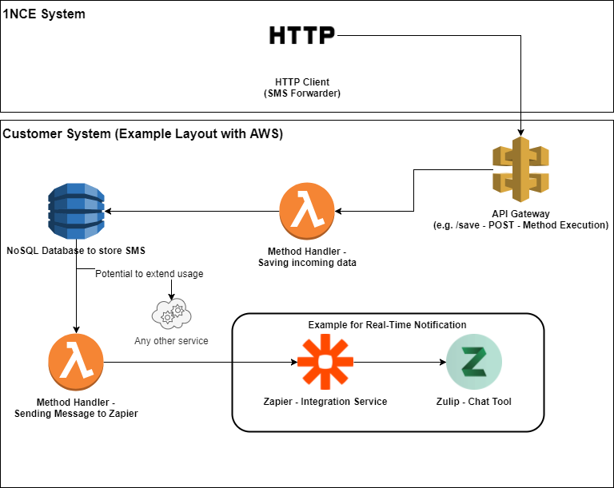

# Setting up SMS Forwarder

For demonstration of the SMS mobile originated we would like to setup the SMS Forwarder for our SIM cards.
Being able to use the feature we need to setup a small backend which is able to handle the SMS messages. 

The 1NCE system can forward MO-SMS to a freely configurable IP/URL. The 1NCE system acts as the HTTPS client. Therefore we must provide an HTTPS server under the specified IP/URL, which is able to receive the requests. 

Example Message send from 1NCE:
```json
{
  "dcs": "0",
  "dest_address": "882285000016868",
  "endpoint": {
    "id": "8778667",
    "name": "8988280666000001075"
  },
  "id": "12934",
  "multi_part_info": {
    "identifier": "12934",
    "partno": 1,
    "total": 1
  },
  "organisation": {
    "id": "5136"
  },
  "payload": "Test nach dem Netzwerk ausfallen. SMS geht auf jeden Fall wieder.",
  "pid": "0",
  "smsforwarderId": "1658de33-e7e4-42c1-a885-e733a5d5b43e",
  "source_address": "882285100001075",
  "submit_date": "2018-11-06 08:40:10"
}
```
## Potential Setup for the SMS Forwarder (Example with AWS)

Depending on the use case for Mobile Originating SMS the system layout can be different. For demonstation purposes the following layout is using Amazon Web Service as Backend and main integration layer. This gives a very scalable layout, which can be integrated and further extended very easily. 



Main goal for all SMS Forwarder Applications should be an harmonized backend which can distribute SMS to multiple applications depending on the needs. 

## Building API Gateway in AWS and storing Messages in DynamoDB

Main Goal: Api Gateway -> Lambda (Put) -> DynamoDB

We are going to build a serverless component consisting of:
* an API Gateway, receiving request data
* a Lambda function, that processes that data and saves
* a DynamoDB table, where all your data is stored.

Aside from this main functionality, its important features are:
* Supports CORS
* Written in Node.js
* Easily composable into your other app components by adding triggers to its DynamoDB table

First we need to put together a small Node.js handler for our Lambda function:
```JavaScript
const AWS = require('aws-sdk');
const dynamoDb = new AWS.DynamoDB.DocumentClient();
const uuidv4 = require('uuid/v4');
const processResponse = require('./process-response.js');
const TABLE_NAME = process.env.TABLE_NAME;
const IS_CORS = process.env.IS_CORS;
const PRIMARY_KEY = process.env.PRIMARY_KEY;

exports.handler = (event) => {
    if (event.httpMethod === 'OPTIONS') {
		return Promise.resolve(processResponse(IS_CORS));
	}
    if (!event.body) {
        return Promise.resolve(processResponse(IS_CORS, 'invalid', 400));
    }
    let item = JSON.parse(event.body);
    item[PRIMARY_KEY] = uuidv4();
    let params = {
        TableName: TABLE_NAME,
        Item: item
    }
    return dynamoDb.put(params)
    .promise()
    .then(() => (processResponse(IS_CORS)))
    .catch(dbError => {
        let errorResponse = `Error: Execution update, caused a Dynamodb error, please look at your logs.`;
        if (dbError.code === 'ValidationException') {
            if (dbError.message.includes('reserved keyword')) errorResponse = `Error: You're using AWS reserved keywords as attributes`;
        }
        console.log(dbError);
        return processResponse(IS_CORS, errorResponse, 500);
    });
};
```

For easy deployment we are going to use a AWS Template written in YML. 
Everything can be found in the folder ../sms-forwarder.

The whole function is based on the following project: https://github.com/simalexan/api-lambda-save-dynamodb

Therefore we are going to use the template as its directly available in AWS already.

First lets log into AWS Console and go to AWS Lambda where we create a new one based on an Application template:


Search in AWS Serverless Application Repository for the applicaton called "api-lambda-save-dynamodb".

Then enter the name of your application and the name of the DynamoDB Table you want to create. Everything else will be maned by a AWS CloudFormation Stack - Which is not topic of the current workshop. 


After successfull deployment you should be able to see all the ressources which were created:


The Stack created a total of 3 resources in AWS:
* ApiSaver => an AWS API Gateway with one RestAPI Endpoint
* DynamoDBTable => A new NoSQL DynamoDB Table
* LambdaSaver => The Lambda function with the above mentioned code

When clicking on the LambdaSaver function and select the incoming API Gateway you find the API Endpoint Link which we need to use for our SMS Forwarder Configuration: 


Copy the API Endpoint and lets configure our SMS Forwarder in the 1NCE Portal. 
Paste the Endpoint URL and Save the changes - They should be active immediately.


YOu can test then function by sending an SMS from the IoT Gateway or a simple Phone with an 1NCE SIM Card. All Mobile Originating SMS from the SIMs you have in your account will be forwarded to the central Database. 

When selecting the DynamoDB Table in AWS it should look similar to the following screenshot:


## Integrating incoming Messages into Application
### Example here Zulip Chat Tool

For demonstration of the possibilities we have to extend the suggested setup we are going to integrate a Chat-Tool called  Zulip. This can be done with any other comaprable tool like Slack or  Microsoft Teams in a similar setup. 

As one of our main goals is to rapidly develop some robust prototypes we are going to use Zapier - An online integration System to connect AWS with Zulip. Zapier has more than 1,000 Apps available which can be easily integrated with each other.
On the other hand our Zulip Chat also has a native intergration with Zapier, so we dont have to build any thing from scratch. 

FIrst lets follow the Zulip tutorial to setup Zapier:
https://1nce.chat.compax.at/integrations/doc/zapier (or documenation from your instance)

* Create the stream you'd like to use for Zapier notifications, and subscribe all interested parties to this stream. We recommend the name zapier. You still need to create the stream even if you are using this default recommendation.
* On your Zulip settings page, create a bot for Zapier. Make sure that you select Incoming webhook as the Bot type: The API key for an incoming webhook bot cannot be used to read messages out of Zulip. Thus, using an incoming webhook bot lowers the security risk of exposing the bot's API key to a third-party service. Fill out the rest of the fields, and click Create bot. Construct the URL for the Zapier bot using the bot's API key and the desired stream name: `https://1nce.chat.compax.at/api/v1/external/zapier?api_key=abcdefgh&stream=zapier
` Modify the parameters of the URL above, where api_key is the API key of your Zulip bot, and stream is the stream name you want the notifications sent to. If you do not specify a stream, the bot will send notifications via PMs to the creator of the bot. If you'd like this integration to always send to the topic your_topic, just add &topic=your_topic to the end of the URL.
* Create a Zap and select the service you'd like to receive notifications from as the Trigger (Step 1). Choose Webhooks by Zapier as the app in Action (Step 2). Select POST as the action, and click Save + Continue.
* Set URL to the URL constructed above. Set Payload Type to JSON. Add the following two fields to Data:
topic corresponds to the topic of a message
content corresponds to the content of a message
Customize the topic and content fields as necessary. Click Continue.

For getting the data actually into Zulip we still need to build the bridge between AWS and Zapier. On Zapier side we are going to use a regular Webhook, so send over a JSON Payload. 

Here is an example setup in Zapier for the integration:


As you can see we using a the Zapier integrated Webhooks function for Trigger as well as Action.

Now lets build another AWS Function to trigger the Webhook in Zapier. 

First we need to create another AWS Lambda function which is later one being triggered by the DynamoDB. 
The function will be using Python and the following code:
```python
import json
from botocore.vendored import requests

print('Loading function')


def lambda_handler(event, context):
    print("Received event: " + json.dumps(event, indent=2))
    for record in event['Records']:
        print(record['eventID'])
        print(record['eventName'])
        print("DynamoDB Record: " + json.dumps(record['dynamodb'], indent=2))
        requests.post("https://hooks.zapier.com/hooks/catch/3973895/e40ph7/", data = json.dumps(record['dynamodb'], indent=2))
    return 'Successfully processed {} records.'.format(len(event['Records']))
```
The for us important point in that code is the request.post command which is holding the Zapier Webhook: 
`requests.post("https://hooks.zapier.com/hooks/catch/3973895/xxxxxx/", data = json.dumps(record['dynamodb'], indent=2))`

This needs to be updated so it holds you actuall Zapier webhook insted of /xxxxxx/.

Then you can select the DynamoDB as a Trigger for the Function: 


The trigger is easily configured by selecting our DynamoDB Table we previously created and saving the function afterwards:


If everything is configured correctly we should see new SMS which are send from any of our devices to our SMSC adress as a new Message / Notification in Zulip. 

Here is an example how it could look like: 

