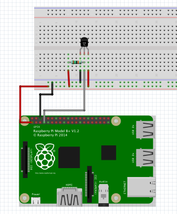

# Device to Server Communication Setup

For demonstration of sending data from an IoT Gateway to on central application Server we are using the 1NCE SIM Card with an Raspberry Pi. 
As this is for demonstration purposes we are going to use a temperatrue sensor connected to the Ras Pi and send it over to an MySQL Server on a central application server. 

## Setting up the Temperature Sensor

We need to connect an basic temperature sensor to our Rasp Pi. 
For example you can use a DS18B20+ and use the wiring template as below. The wiring is fairly simple, just a 3.3V supply voltage, ground and data. There is a 10K pull up resistor from Vdd to data just so the pin isn’t floating.



## Reading the Temperature Sensor

We need to load the drivers for the 1-wire comms and the temp sensor into the Pi kernel. Modprobe is a Linux program to add a loadable kernel into the Linux kernel. In your terminal enter:

```bash
sudo modprobe w1-gpio
sudo modprobe w1-therm
```
Now change your working directory to:

```bash
cd /sys/bus/w1/devices/
```
This is where the devices running on the 1-wire will be. So to find our newly created device just list the contents of the directory with ls.

```bash
ls
```
Now you should see something listed like

`28-00000622fd44 w1_bus_master1`

This is the serial number for the device. To interrogate that device we need to go into its directory. Make sure you use the serial number of your own sensor!!

```bash
cd 28-00000622fd44
```
The sensor writes to a file called w1_slave so if we just read that file we can now finally know what temperature it is. Enter:

```bash
cat w1_slave
```
cat simply displays the contents of a file. 
You will get the following output:

```
0b 01 4b 46 7f ff 05 10 a8 : crc=a8 YES

0b 01 4b 46 7f ff 05 10 a8 t=16687
```

## Reading the Temperature Sensor with Python Script

Setting up an Python script to read the Sensor value.
Go back to the root directory and make a new directory called tempLog.

```bash
cd
mkdir tempLog
```
Go into the new directory and create a new python file in nano.

```bash
cd tempLog
sudo nano getTemp.py
```

Copy the code below taking care to use your own value for the sensor.

```python
import os
import time
import datetime
import glob
from time import strftime
 
os.system('modprobe w1-gpio')
os.system('modprobe w1-therm')
temp_sensor = '/sys/bus/w1/devices/28-00000622fd44/w1_slave'
 
def tempRead():
        t = open(temp_sensor, 'r')
        lines = t.readlines()
        t.close()
 
        temp_output = lines[1].find('t=')
        if temp_output != -1:
                temp_string = lines[1].strip()[temp_output+2:]
                temp_c = float(temp_string)/1000.0
        return round(temp_c,1)
 
while True:
    temp = tempRead()
    print temp
    datetimeWrite = (time.strftime("%Y-%m-%d ") + time.strftime("%H:%M:%S"))
    print datetimeWrite
    break
```

Now lets give it a go. While still in the tempLog directory enter:

```
sudo python readTemp.py
```
You will get something like this:

```
pi@raspberrypi ~/tempLog $ sudo python readTemp.py
16.4
2014-12-24 11:51:08****
```

## Setting up an MySQL Server for remote logging

Important to run the following command on our PI, so that we are able to use the MySQL later on: 

```
sudo apt-get install python-mysqldb
```
Now open MySQL on the remote server:

```
sudo mysql –u –p
```

This logs us in to MySQL as the root user (-u) and it will prompt for a password (-p) on entry.

We are now going to create a database, e.g. temp_database. 

```sql
CREATE DATABASE temp_database;
```

We can check this has worked by entering the below. A list of the databases currently held by MySQL will be displayed.

```sql
SHOW DATABASES;
```
Now we want to make a new table in the temp_database. To this we firstly have to tell MySQL that we wish to use the temp_database:

```sql
USE temp_database;
```
We now create a table in MySQL using the following commands. Both must have values (i.e. not null).

```sql
CREATE TABLE tempLog(datetime DATETIME NOT NULL, temperature FLOAT(5,2) NOT NULL);
```
To check that our table is correct we can check by entering the following:

```sql
mysql> DESCRIBE tempLog;
```
You will get the following output, describing the table’s fields.

```bash
+————-+————+——+—–+———+——-+
| Field       | Type       | Null | Key | Default | Extra |
+————-+————+——+—–+———+——-+
| datetime   | datetime   | NO   |     | NULL   |       |
| temperature | float(5,2) | NO   |     | NULL   |       |
+————-+————+——+—–+———+——-+
```

## Updating our Python Script to write into MySQL Server

Switch back to the Rasp Pi and open up the already existing Python file.
```
sudo nano readTempSQL.py
```

Copy the following code into your new Python application.

```Python
import os
import time
import datetime
import glob
import MySQLdb
from time import strftime
 
os.system('modprobe w1-gpio')
os.system('modprobe w1-therm')
temp_sensor = '/sys/bus/w1/devices/28-00000622fd44/w1_slave'
 
# Variables for MySQL
db = MySQLdb.connect(host="localhost", user="root",passwd="password", db="temp_database")
cur = db.cursor()
 
def tempRead():
    t = open(temp_sensor, 'r')
    lines = t.readlines()
    t.close()
 
    temp_output = lines[1].find('t=')
    if temp_output != -1:
        temp_string = lines[1].strip()[temp_output+2:]
        temp_c = float(temp_string)/1000.0
    return round(temp_c,1)
 
while True:
    temp = tempRead()
    print temp
    datetimeWrite = (time.strftime("%Y-%m-%d ") + time.strftime("%H:%M:%S"))
    print datetimeWrite
    sql = ("""INSERT INTO tempLog (datetime,temperature) VALUES (%s,%s)""",(datetimeWrite,temp))
    try:
        print "Writing to database..."
        # Execute the SQL command
        cur.execute(*sql)
        # Commit your changes in the database
        db.commit()
        print "Write Complete"
 
    except:
        # Rollback in case there is any error
        db.rollback()
        print "Failed writing to database"
 
    cur.close()
    db.close()
    break
```
This is a modification of our original Python app but we are adding code to handle the MySQL functionality. Firstly, at the top of the app we add an import for the MySQLdb Python library we downloaded earlier. A bit further down you will see variables that will be used when communicating with MySQL (password, user, host etc) – remember to change them to your variables!

Now run the Python app we just made a few times.

```
sudo python readTempSQL.py
```
You should see the following output on your terminal window if all has worked:

```
pi@raspberrypi ~/tempLog $ sudo python readTempSQL.py
18.6
2015-01-04 22:29:24
Writing to database…
Write Complete
```

Now lets check that the Python app actually entered data into the MySQL database. Log back into MySQL and USE the temp_database. We can then query the tempLog table:

```
mysql -u root -p
USE temp_database;
mysql> SELECT * FROM tempLog;
```
The shown output should look similar to the following:
```bash
+———————+————-+

| datetime           | temperature |
+———————+————-+
| 2014-12-28 17:26:20 |       18.90 |
| 2014-12-28 17:27:05 |       18.90 |
| 2014-12-28 17:27:52 |       18.90 |
| 2014-12-28 17:30:39 |       19.00 |
| 2014-12-28 17:31:02 |       18.90 |
+———————+————-+
5 rows in set (0.00 sec)
```

## Scheduling temperature readings

Now wouldn’t it be nice to have our python app work autonomously, putting a temperature reading into the database every 5 minutes. We are going to use crontab for that.

To open Crontab enter the following in your terminal.

```
crontab -e

```
Inside the Crontab file enter the following at the bottom. 

```
*/5 * * * * /home/pi/tempLog/readTempSQL.py
```

To make the Python app executable, firstly enter the following at the top of the readTempSQL.py file.

```
#!/usr/bin/env python
```

Now we just need to change the file permission to executable.

```
sudo chmod +x readTempSQL.py
```
To test that the file is now executable, navigate to your tempLog directory and enter

```
./readTempSQL.py
```

Check your database after 10 minutes or so to make sure your Cronjob is working as when the app is run by Crontab the output is not displayed in the terminal window.

## Optional: PHP File to show the values in Browser

For this to work you need to install the following packages. 
To install Apache and PHP on Ubuntu use the following comands:

```bash
sudo apt-get install apache2 php5 libapache2-mod-php5
```

Now lets make a php script to return our database data. Change directory to 
```bash
/var/www
```
and make a new file called temperaturejson.php.

```bash
sudo nano temperaturejson.php
```

Enter the following into that new file:

```php
<?php
  
$username="root";
$password="password";
$database="temp_database";
  
mysql_connect(localhost,$username,$password);
@mysql_select_db($database) or die( "Unable to select database");
  
$query="SELECT * FROM tempLog";
$result=mysql_query($query);
  
$num=mysql_numrows($result);
  
mysql_close();
  
$tempValues = array();
  
$i=0;
while ($i < $num)
{
        $dateAndTemps = array();
        $datetime = mysql_result($result,$i,"datetime");
        $temp = mysql_result($result,$i,"temperature");
  
        $dateAndTemps["Date"] = $datetime;
        $dateAndTemps["Temp"] = $temp;
  
        $tempValues[$i]=$dateAndTemps;
        $i++;
}
  
echo json_encode($tempValues);
  
?>
```

Connect to the website with your servers IP Adress for example:
http://192.168.0.11/temperaturejson.php

If all has worked correctly you will get an output similar to this:
```json
[{“Date”:”2014-12-28 17:26:20″,”Temp”:”18.90″},{“Date”:”2014-12-28 17:27:05″,”Temp”:”18.90″},{“Date”:”2014-12-28 17:27:52″,”Temp”:”18.90″},{“Date”:”2014-12-28 17:30:39″,”Temp”:”19.00″},{“Date”:”2014-12-28 17:31:02″,”Temp”:”18.90″},{“Date”:”2015-01-04 22:29:24″,”Temp”:”18.60″},{“Date”:”2015-05-14 20:56:07″,”Temp”:”21.80″},{“Date”:”2015-05-17 19:55:05″,”Temp”:”22.90″},{“Date”:”2015-05-17 19:56:17″,”Temp”:”22.90″},{“Date”:”2015-05-17 20:06:18″,”Temp”:”23.00″},{“Date”:”2015-05-17 20:47:03″,”Temp”:”23.20″}]
```